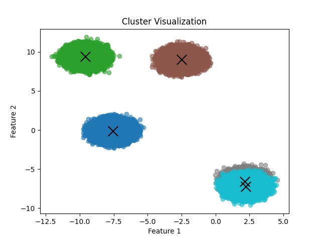

# Parallelized Gaussian Mixture Model Clustering

Three implementations of **Gaussian Mixture Model (GMM) clustering** trained with the
**Expectation–Maximization (EM)** algorithm, written to study how the same algorithm scales
across different parallel programming models:

| Implementation | Folder | Technology | Target |
|---|---|---|---|
| Sequential baseline | [`sequential/`](sequential) | C++ + Eigen | 1 CPU core |
| Hybrid distributed/shared memory | [`mpi-omp/`](mpi-omp) | C++ + Eigen + MPI + OpenMP | multi-node CPU cluster |
| GPU | [`cuda/`](cuda) | CUDA C + cuBLAS | NVIDIA GPU |

All versions were developed and benchmarked on a university HPC cluster managed by
**SLURM**, with dependencies provided through **Spack**. Python utilities are included to
generate synthetic datasets, compute a scikit-learn reference solution and plot the result.



---

## The algorithm

A GMM models the data as a weighted sum of `k` multivariate Gaussians, each with a mean
vector `μⱼ`, a full covariance matrix `Σⱼ` and a mixing weight `πⱼ`. EM alternates two steps:

1. **E-step** – for every point `xᵢ` and cluster `j`, compute the *responsibility*
   `γᵢⱼ = πⱼ · N(xᵢ | μⱼ, Σⱼ) / Σₗ πₗ · N(xᵢ | μₗ, Σₗ)`.
   The inverse and determinant of each `Σⱼ` are computed once per iteration.
2. **M-step** – update the parameters from the responsibilities:
   `Nⱼ = Σᵢ γᵢⱼ`, `πⱼ = Nⱼ / N`, `μⱼ = Σᵢ γᵢⱼ xᵢ / Nⱼ`,
   `Σⱼ = Σᵢ γᵢⱼ (xᵢ − μⱼ)(xᵢ − μⱼ)ᵀ / Nⱼ` (+ a small regularization term on the diagonal).

Both steps are dominated by independent per-point work followed by a reduction over all
points, which is what the parallel versions exploit.

Default configuration used throughout the experiments: **k = 5 clusters, d = 10 features,
5 EM iterations**.

## Implementations

### Sequential — `sequential/gmm-seq.cpp`
Straightforward Eigen implementation used as the baseline. Means are initialized from
random data points, covariances as identity matrices. Prints the time of every E-step,
M-step and iteration, the total time and the final parameters.

### MPI + OpenMP — `mpi-omp/gmm_mpi_omp.cpp`
- Rank 0 loads the CSV and distributes the points with `MPI_Scatterv` (balanced chunks).
- Rank 0 computes the inverse/determinant of each covariance matrix and broadcasts them.
- **E-step**: each rank computes the responsibilities of its local points, parallelized with
  an OpenMP `parallel for`.
- **M-step**: local partial sums (weights, means, covariances) computed with OpenMP, then
  combined with `MPI_Reduce` on rank 0 and redistributed with `MPI_Bcast`.
- Rank 0 prints the total elapsed time (first line of output), the cumulative E/M-step times
  and the final parameters.

`gmm_mpi_omp_old.cpp` is an earlier version (inverse and determinant recomputed inside the
Gaussian evaluation for every point) that is still used by `compile_mpi.sh`.

### CUDA — `cuda/gmm-cuda-stride-reduction.cu`
- Means initialized on the host with **k-means++**.
- Batched LU factorization and inversion of the covariance matrices with cuBLAS
  (`cublasDgetrfBatched` / `cublasDgetriBatched`); determinants derived from the LU factors.
- `computeResponsibilities` kernel using a **grid-stride loop**: each thread processes
  `dataPerThread` points and accumulates per-thread partial weights and means.
- `reduceWeightMean` and `reduceCovMatrices` kernels perform a **shared-memory tree
  reduction** of the partial results (one block per cluster); `mStep` computes the per-thread
  partial covariance matrices.
- Writes the final model to `../py/model_params.csv` and the responsibilities to
  `../py/responsibilities.csv`, which `py/plot.py` uses to draw the clusters.

`cuda/gmm-cuda-old.cu` is the previous iteration of the same kernel design.

### Prototypes — `prototypes/`
Earlier CUDA experiments kept for reference: the first naive port (`gmm-cuda.cu`), a
grid-stride version (`gmm-cuda-grid-stride.cu`), a version with a parallel M-step
(`gmm-cuda-stride-mstep*.cu`), standalone tests of the cuBLAS matrix inversion
(`inverse*.cu`) and an Nsight Systems profiling report (`profiling_report.nsys-rep`).

## Repository structure

```
.
├── sequential/         # Sequential C++/Eigen baseline + SLURM script
├── mpi-omp/            # MPI + OpenMP implementation + SLURM benchmark scripts
│   └── results/final/  # Strong / weak scaling benchmark logs
├── cuda/               # CUDA implementation + SLURM scripts
├── prototypes/         # Earlier CUDA experiments and profiling report
├── py/                 # Dataset generator, scikit-learn reference, plotting
├── results/
│   ├── seq/            # Sequential timings (with and without -O3)
│   └── dataPerTh/      # CUDA timings while sweeping the points-per-thread parameter
└── data/               # (git-ignored) generated CSV datasets
```

## Requirements

- **Sequential / MPI+OpenMP**: a C++ compiler with OpenMP support, an MPI implementation
  providing `mpic++` (e.g. OpenMPI), [Eigen 3](https://eigen.tuxfamily.org) (header-only).
- **CUDA**: CUDA Toolkit (`nvcc`, cuBLAS) and an NVIDIA GPU.
- **Python tools**: Python 3 and the packages in [`py/requirements.txt`](py/requirements.txt).
- **Cluster scripts**: SLURM (`sbatch`, `srun`) and Spack (`spack load eigen`, `spack load cuda`).

## Usage

> All programs read the dataset from `../data/1M.csv` **relative to the working directory**,
> so always launch them from inside their own folder (`sequential/`, `mpi-omp/`, `cuda/`).
> Parameters (`k`, number of iterations, dataset path, CUDA `dataPerThread`, …) are constants
> at the top of each `main()`.

### 1. Generate a dataset

`py/generator.py` creates isotropic Gaussian blobs with scikit-learn
(`make_blobs`: 5 centers, 10 features, std 0.5) and saves them as header-less CSV files
under `data/`. It can also fit scikit-learn's `GaussianMixture` to obtain a reference
solution and timing.

```bash
python3 -m venv venv && source venv/bin/activate
pip install -r py/requirements.txt
mkdir -p data
cd py
python3 generator.py
```

What the script does is selected in `main()`:
- as committed, it loads `../data/1M.csv` and fits the scikit-learn reference model;
- uncomment `create_sample_data(...)` + `save_dataset(X, "../data/1M.csv")` to create the
  dataset first (the default `n_samples` is 1M);
- uncomment `generate_iter_dataset()` to create the series of datasets (72k … 864k points)
  used for weak scaling.

### 2. Run on a SLURM cluster

Each folder contains ready-to-submit batch scripts; submit them from inside that folder.
They load dependencies with Spack, compile into `./build/`, run the program and write
stdout/stderr to `./results/`. Partition names (`broadwell`, `gracehopper`, `cascadelake`)
refer to the original cluster and may need to be adapted.

| Script | What it does |
|---|---|
| `sequential/compile_seq.sh` | Compiles with `-O3` and runs the sequential version |
| `mpi-omp/compile_mpi.sh` | Single run on 2 nodes, 6 MPI tasks × 9 OpenMP threads |
| `mpi-omp/run_gmm_omp_mpi_batch.sh` | Strong scaling sweep (1–12 nodes, several processes/threads mixes, 3 runs each) — 100k points |
| `mpi-omp/run_gmm_omp_mpi_batch_1M.sh` | Same sweep — 1M points |
| `mpi-omp/run_gmm_omp_mpi_batch_20M.sh` | Same sweep — 20M points |
| `mpi-omp/run_gmm_omp_mpi_batch_weak_scaling.sh` | Weak scaling sweep, 72k points per node |
| `cuda/compile_cuda-stride-reduction.sh` | Compiles and runs the CUDA version on 1 GPU |
| `cuda/compile_loop.sh` | Runs the CUDA version for a sweep of `dataPerThread` values |

```bash
cd mpi-omp
sbatch run_gmm_omp_mpi_batch_1M.sh
```

### 3. Run locally (without SLURM)

```bash
# Sequential
cd sequential && mkdir -p build
g++ -O3 -I/usr/include/eigen3 gmm-seq.cpp -o build/gmm-seq -lm
./build/gmm-seq

# MPI + OpenMP (e.g. 4 processes × 2 threads)
cd mpi-omp && mkdir -p build
mpic++ -O3 -fopenmp -I/usr/include/eigen3 gmm_mpi_omp.cpp -o build/gmm_mpi_omp
OMP_NUM_THREADS=2 mpirun -np 4 ./build/gmm_mpi_omp

# CUDA
cd cuda && mkdir -p build
nvcc gmm-cuda-stride-reduction.cu -o build/gmm-cuda-stride-reduction -lcudart -lcublas -lm
./build/gmm-cuda-stride-reduction
```

Adjust the Eigen include path to your installation (on the cluster it is
`$(spack location -i eigen)/include`).

### 4. Plot the clusters

After a CUDA run has written `py/model_params.csv` and `py/responsibilities.csv`:

```bash
cd py
python3 plot.py   # saves cluster_plot.png
```

## Results

Wall-clock times for 5 EM iterations (k = 5, d = 10), taken from the logs in this
repository. CPU runs used the cluster's `broadwell` partition (36 cores per node). MPI times
are the mean of 3 runs.

| Dataset | Sequential `-O3` | MPI+OpenMP, 1 process × 1 thread | MPI+OpenMP, best configuration | CUDA, best `dataPerThread` |
|---|---|---|---|---|
| 100k points | 0.86 s | 16.76 s | **0.68 s** (12 nodes, 48 proc × 9 thr) | 0.21 s ¹ |
| 1M points | 10.51 s | 168.71 s | **6.44 s** (11 nodes, 44 proc × 9 thr) | **1.35 s** |
| 20M points | 192.69 s | 3370.96 s | **150.45 s** (4 nodes, 16 proc × 9 thr) ² | **24.65 s** |

¹ measured on a 133k-point dataset.
² the 20M sweep hit the job time limit after 19 configurations (up to 4 nodes).

Notes:
- The MPI batch scripts compile without `-O3`, so the "1 × 1" column is directly comparable to
  the non-optimized sequential runs (`results/seq/seq_1M.txt`: 155.97 s,
  `seq_100k.txt`: 15.56 s) rather than to the `-O3` baseline.
- Weak scaling (72k points per node): best time 0.91 s on 1 node and 5.51 s on 12 nodes
  (`mpi-omp/results/final/run_gmm_omp_mpi_batch_output_weak.txt`).
- `results/dataPerTh/` contains the full CUDA sweep over the number of points processed by
  each thread; the `*-lower.txt` files use a finer sweep around the optimum.

Raw logs:
[`results/seq/`](results/seq), [`sequential/results/`](sequential/results),
[`mpi-omp/results/`](mpi-omp/results), [`results/dataPerTh/`](results/dataPerTh),
[`cuda/results/`](cuda/results).

## Known limitations

This is research/benchmark code, kept as it was run on the cluster:

- Configuration is hard-coded (dataset path, `k`, iterations; CUDA also assumes `d ≤ 10` in
  the shared-memory reduction buffers). Command-line arguments passed by
  `cuda/compile_loop.sh` and `mpi-omp/run_gmm_omp_mpi_batch_weak_scaling.sh` are ignored by
  the current sources, which always load `../data/1M.csv` with `dataPerThread = 100`;
  the sweep and weak-scaling logs were produced by variants that read these values from
  `argv`.
- The MPI batch scripts expect the program to print only the elapsed time; the current
  `gmm_mpi_omp.cpp` also prints the E/M-step times and the final parameters, so the
  script's number check has to be adapted (e.g. keep only the first output line) before
  re-running the sweeps.
- In the OpenMP M-step loops of `gmm_mpi_omp.cpp` the partial sums are accumulated into
  shared arrays without a reduction, so with more than one thread per process the result
  may be affected by data races.
- Program output (log messages, comments) is in Italian.
